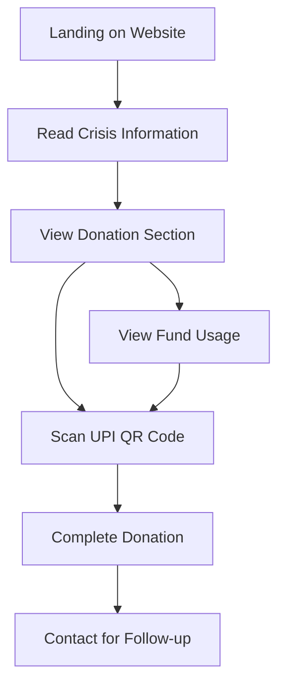

# Help Nest Foundation - Gaza Crisis Support Website

## 1. Product Overview

A single-page fundraising website for Help Nest Foundation dedicated to supporting survivors of the Gaza crisis through direct UPI donations.

* Provides an accessible platform for people to understand the Gaza crisis situation and contribute instantly via QR code scanning.

* Targets compassionate individuals seeking a transparent, quick way to make meaningful donations to Gaza crisis survivors.

## 2. Core Features

### 2.1 User Roles

| Role    | Registration Method      | Core Permissions                           |
| ------- | ------------------------ | ------------------------------------------ |
| Visitor | No registration required | Can view content, scan QR code, and donate |

### 2.2 Feature Module

Our Help Nest Foundation website consists of the following main sections:

1. **Hero Section**: Foundation branding, mission statement, and primary call-to-action.
2. **Crisis Information**: Emotional description of Gaza crisis and impact explanation.
3. **Donation Section**: Static UPI QR code with donation instructions and transparency information.
4. **Trust Building**: Contact information, fund usage details, and credibility elements.

### 2.3 Page Details

| Page Name | Module Name         | Feature description                                                                                                     |
| --------- | ------------------- | ----------------------------------------------------------------------------------------------------------------------- |
| Main Page | Hero Section        | Display Help Nest Foundation logo, compelling headline about Gaza support, and prominent donation call-to-action button |
| Main Page | Crisis Information  | Present concise, emotional description of Gaza crisis situation and explain how donations directly help survivors       |
| Main Page | Donation Section    | Show static UPI QR code prominently with clear scanning instructions and donation amount suggestions                    |
| Main Page | Fund Usage          | Display transparent breakdown of how donations are utilized with percentages or examples                                |
| Main Page | Contact Information | Provide email address and WhatsApp number for inquiries and trust-building                                              |
| Main Page | Testimonials        | Include brief testimonials or impact stories to enhance credibility and emotional connection                            |

## 3. Core Process

The main user flow is straightforward and focused on conversion:

**Visitor Flow:**

1. User lands on the website and sees Help Nest Foundation branding
2. User reads about the Gaza crisis and understands the urgent need
3. User views the donation section with clear QR code
4. User scans QR code with their mobile banking app
5. User completes donation through UPI interface
6. User can access contact information for follow-up or questions

## 4. User Interface Design

### 4.1 Design Style

* **Primary Colors**: Deep blue (#1e3a8a) for trust and stability, warm orange (#f97316) for urgency and action

* **Secondary Colors**: Light gray (#f8fafc) for backgrounds, dark gray (#374151) for text

* **Button Style**: Rounded corners with subtle shadows, prominent orange donation buttons

* **Font**: Clean sans-serif font (Inter or similar), 16px base size, 24px+ for headings

* **Layout Style**: Single-column layout with clear sections, card-based information blocks

* **Icons**: Simple, compassionate icons (heart, hands, home) in line style

### 4.2 Page Design Overview

| Page Name | Module Name         | UI Elements                                                                                                   |
| --------- | ------------------- | ------------------------------------------------------------------------------------------------------------- |
| Main Page | Hero Section        | Large foundation logo, bold headline in deep blue, orange "Donate Now" button, background with subtle pattern |
| Main Page | Crisis Information  | Card layout with emotional image, readable text in dark gray, highlighted statistics in orange                |
| Main Page | Donation Section    | Centered QR code with border, step-by-step instructions, suggested amounts in buttons, trust badges           |
| Main Page | Fund Usage          | Progress bars or pie chart showing fund allocation, icons for different uses (food, shelter, medical)         |
| Main Page | Contact Information | Simple contact cards with icons, WhatsApp and email buttons in brand colors                                   |
| Main Page | Testimonials        | Quote cards with subtle shadows, profile images, names and brief stories                                      |

